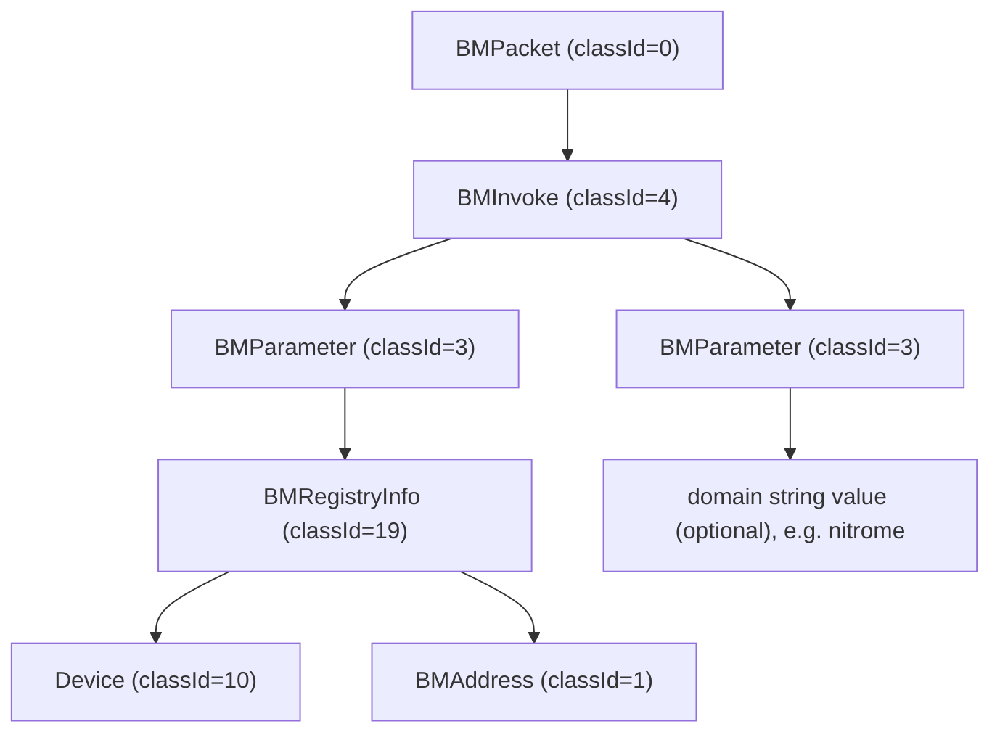

# Object Encoding

BM uses a custom binary serialization format. All data is encoded in **little-endian** byte order.

Every class that can be serialized is called an `Externalizable` class. These classes define at least two methods: `readExternal()` for deserialization and `writeExternal()` for serialization. Each class also has a fixed [Class ID](class-ids.md).

## Object Envelope

Every serialized object begins with a 5-byte envelope:

| Offset | Size | Value | Description |
|--------|------|-------|-------------|
| 0 | 2 | `01 00` | UTF string length prefix (value `1`) |
| 2 | 1 | `40` | The character `@` (UTF-8) |
| 3 | 2 | varies | Class ID (i16, little-endian) |

Bytes 0-2 make up the UTF string `"@"`, which acts as an object marker. The deserializer reads this using `readUTF()`.

The class ID at offset 3 identifies the object type. The deserializer looks it up in the [Class ID Registry](class-ids.md), creates an instance of the class, and calls its `readExternal()` method to decode the remaining bytes.

After the envelope, the object's fields follow in the order defined by its `writeExternal()` / `readExternal()` implementation. See [Primitive Types](primitives.md) for the encoding of individual field types.

## TCP vs UDP Serialization

The envelope and object body are identical regardless of transport. The only difference is the framing:

- **UDP**: The serialized object (envelope + fields) is sent as-is. The datagram boundary delimits the message.
- **TCP**: A 4-byte little-endian prefix is prepended before the envelope. This prefix contains the number of bytes that follow (envelope + fields), excluding the prefix itself.

TCP wire layout:

```
[length prefix (i32)] [envelope (5 bytes)] [object fields...]
|<---- 4 bytes ---->| |<----------- length bytes ----------->|
```

UDP wire layout:

```
[envelope (5 bytes)] [object fields...]
```

## Object Nesting

Objects can contain other objects as fields. When a field is an object type, a new envelope is written inline, producing a nested structure. There is no explicit depth limit.

For example, a `registry.register` packet produces the following nesting on the wire:



Each object node in the tree has its own 5-byte envelope on the wire. The deserializer recursively reads them through `readObject()` calls, each of which reads an envelope, creates the appropriate class instance, and calls `readExternal()` on it.

## Example

The following shows the first 14 bytes of a serialized `BMPacket` on TCP, with the object body truncated:

| Bytes | Value | Field |
|-------|-------|-------|
| `eb 00 00 00` | 235 | TCP length prefix |
| `01 00 40` | `"@"` | Object marker (UTF string) |
| `00 00` | 0 | Class ID (`BMPacket`) |
| `03 00 00 00` | 3 | channel (first `BMPacket` field) |
